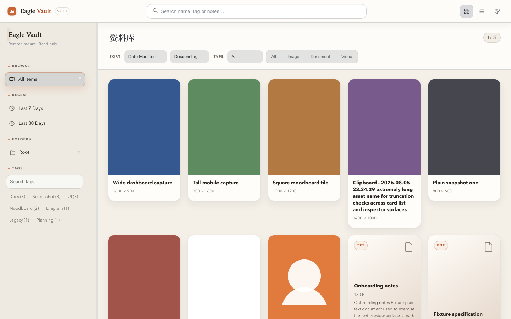
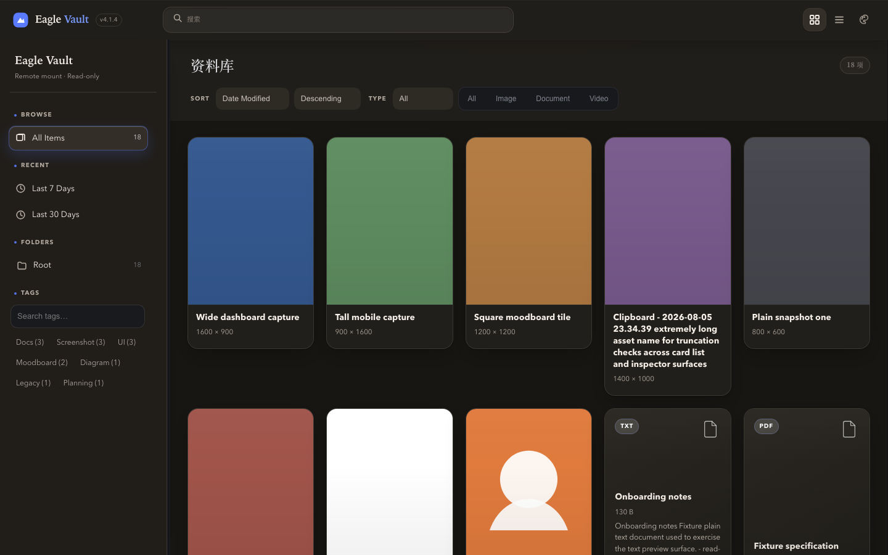
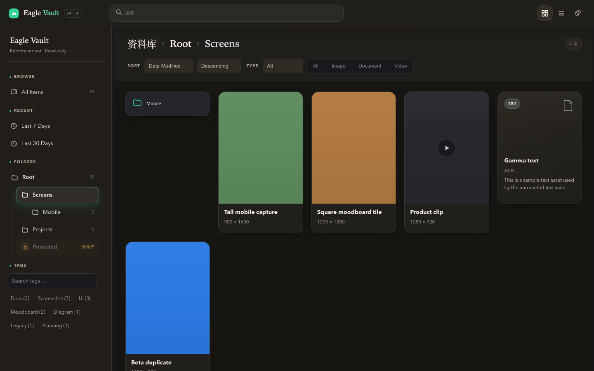
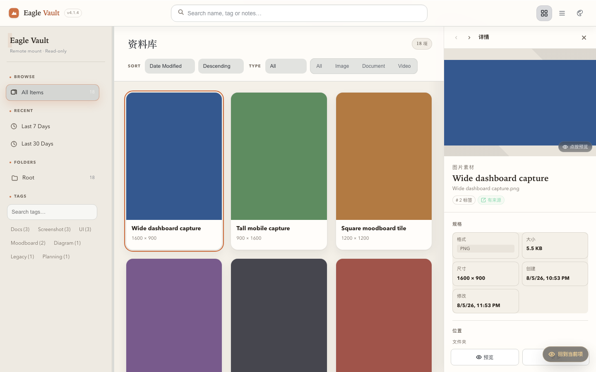
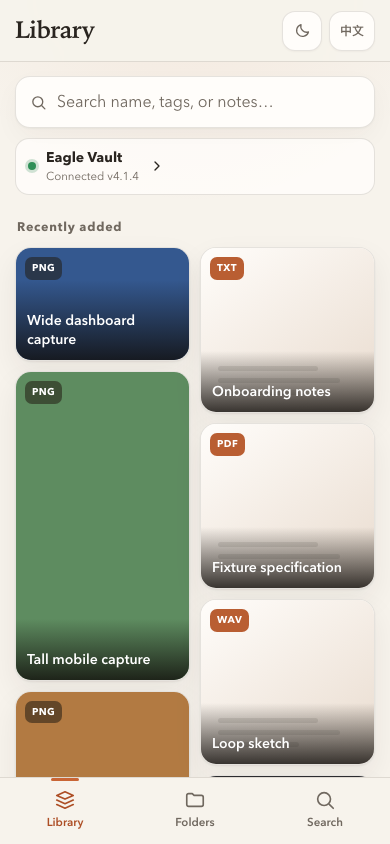
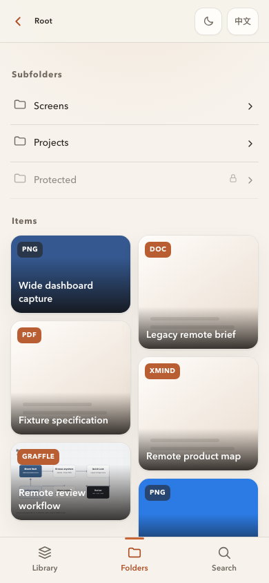
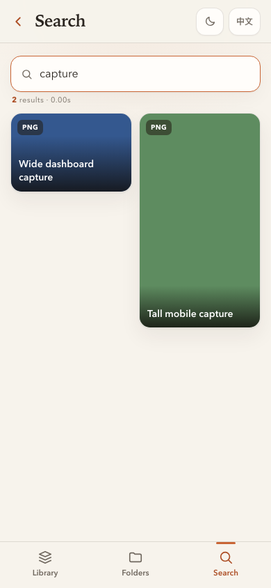
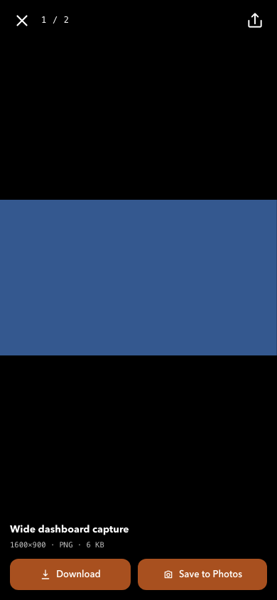

# Eagle Vault Viewer

[](LICENSE)
[](pyproject.toml)
[](https://github.com/hanops/eagle-viewer/releases)

> A read-only web viewer for [Eagle](https://eagle.cool/) libraries — browse, search, preview, and download your creative assets from NAS or a remote host on any device.

[Eagle](https://eagle.cool/) is a popular desktop app for organizing design assets, images, videos, audio, and documents. Eagle Vault Viewer takes the Eagle library you already sync to your NAS and makes it accessible from computers, tablets, and phones that can't run Eagle itself — without installing anything.

Vault is always mounted **read-only**. It never modifies files inside the library.

**Current version**: v4.3.5 (2026-08-08) · [Changelog](CHANGELOG.md) · [中文版](README.zh.md)

---

## Screenshots

> Screenshots showing the viewer in action. Generated with the sample test library.

### Desktop

| Gallery (light) | Workbench (dark) |
|:---:|:---:|
|  |  |
| Carbon (dark, folder view) | Inspector |
|  |  |

### Mobile

| Library | Folders | Search | Preview |
|:---:|:---:|:---:|:---:|
|  |  |  |  |

---

## Features

- **Browse**: Parses the Eagle library folder tree (`metadata.json`) and displays assets from each `*.info/metadata.json`.
- **Views**: All Items, Recent 7/30 Days, By Folder, By Tag, Search.
- **Incremental loading**: All Items, Recent, Folders, Tags and Search views load in batches as you scroll — no giant renders.
- **Gallery layout**: Compact three-column shell with library tree, density-adjustable asset canvas, and Inspector.
- **View modes**: Waterfall masonry and list layout; thumbnail density is adjustable and persists across sessions.
- **Inspector**: Click any asset to open its detailed card — large preview, dimensions, format, folder path, tags, source URL, Eagle notes, asset ID. Copy share link or download from within the Inspector.
- **Left navigation**: Folder tree with expand/collapse, draggable sidebar width, folder counts (including children), hide/show toggle — all persisted locally.
- **Sort & filter**: Sort by modified/created date, name, size, or format. Filter by image, video, document, audio, or other.
- **Password-protected folders**: Eagle password-protected folders (and their descendants) are excluded from indexing, search, thumbnails, and file endpoints.
- **Remote update awareness**: Detects Vault directory and metadata changes; prompts in-place reload.
- **Hover preview**: 300 ms hover over thumbnails shows a larger preview. PDF also supports hover preview.
- **Card actions**: Desktop hover shows preview and details. Right-click and mobile long-press expose select, copy link, and download.
- **Preview & download**: Images, video, audio, PDF, and plain text preview inline. Other formats are downloadable. Downloads preserve the original filename.
- **Audio player**: Audio assets open in a full-featured player showing format, duration, BPM, and native playback controls.
- **Image tools**: Full-screen image viewer with zoom-to-fit, fit-to-window, and zoom-in controls. Video/audio use native browser controls.
- **Multi-select**: Select assets and copy their links. Touch-friendly on mobile.
- **Previous / next navigation**: Inspector supports ← / → keyboard shortcuts to cycle through assets.
- **Share**: Copy asset links from Inspector, context menu, mobile long-press, and full-screen preview.
- **Manual index refresh**: One-click reload from the toolbar — no server restart needed to pick up new NAS content.
- **Copy to clipboard**: Image assets can be copied directly (requires HTTPS or localhost).
- **Keyboard shortcuts**: `Esc` to deselect or close preview/Inspector; `←` / `→` to navigate items in Inspector.
- **Quick search**: Search by name, tags, or notes. Inline tag search available.
- **Hash URLs**: Current folder, tag, search, sort, type, and open asset are reflected in the URL hash — shareable and restoreable.
- **Three themes**: Gallery (light, warm terracotta — default), Workbench (dark, blue accent), Carbon (dark, green accent). Theme switching changes colors only, never layout. Toolbar, sidebar, cards, and mobile sheets all follow the active theme. Preference is persisted.
- **PWA**: Installable to home screen with shell caching. Assets and API data always fetch from the remote Vault.
- **Mobile-optimized**: Three-tab bottom navigation (Library, Folders, Search). Touch preview, long-press actions, gesture-driven sheet closing, theme sync, and safe-area insets.
- **Inline SVG icons**: All icons are inline SVGs — crisp and consistent.

---

## Product Boundaries

The web viewer focuses on **remote read-only browsing**, **not** replicating Eagle's full workstation in the browser. It surfaces library, folders, tags, search, preview, asset links, downloads, and basic multi-select. It does **not** provide organization queues, ratings, favorites, workspaces, Viewer notes, review markers, smart views, Eagle smart folders, duplicate analysis, color spectrum, random walk, command palette, advanced reference export, or offline data management.

iPhone / iPad use the same web app. Open the remote URL in Safari, then tap **Share → Add to Home Screen** for a standalone window. The three bottom tabs are Library, Folders, and Search.

Browser-cached PWA shell + IndexedDB thumbnail cache means previously viewed images rehydrate instantly on weak or offline networks. Asset lists, originals, and unseen thumbnails still require a live Vault connection.

## Privacy

Eagle Vault Viewer is **fully offline and self-contained**:

- **No telemetry, no analytics, no external requests** — the app never phones home. No tracking pixels, no crash reporters, no usage statistics.
- **No third-party CDN** — all frontend assets (CSS, JS, fonts, icons) are bundled and served from the app itself. No Google Fonts, no external icon sets.
- **Your data stays on your network** — the Eagle library is parsed and served entirely on your own machine or NAS. Nothing is sent to external servers.
- **Optional authentication** — set `VIEWER_PASSWORD` in your environment and the app requires a login page before accessing any data. API access can be further restricted with `VIEWER_API_TOKEN`.
- **Docker images** are built from source using the provided `Dockerfile`. There are no pre-built binaries from unknown sources — you control exactly what runs.

The only network activity is between your browser and the server you control (LAN, VPN, or optional HTTPS via your own reverse proxy).

---

## Quick Start

### Docker (recommended, for NAS)

1. Mount your Eagle library directory into the container at `/vault`.
2. Build and start:

```bash
# Edit docker-compose.yml to point volumes at your library, e.g.:
# volumes:
#   - /volume1/eagle/Design.library:/vault:ro

docker compose up -d --build
```

3. Open `http://<NAS-or-host-IP>:8000` in your browser.

#### Remote access (LAN / VPN / HTTPS)

Clients access the viewer via HTTP — **never mount `.library` on the phone**. The Vault lives on the server only:

- **LAN**: Same WiFi → `http://<server-ip>:8000/mobile.html`
- **VPN (recommended)**: Tailscale / ZeroTier / WireGuard → `http://<vpn-ip>:8000/mobile.html`
- **HTTPS**: Required for `navigator.share` and clipboard write. Enable via Caddy reverse proxy (see [`Caddyfile.example`](Caddyfile.example)) or a Tailscale Funnel.

Full server-mount + remote-access example: [`docker-compose.remote.example.yml`](docker-compose.remote.example.yml). See also the companion [`Caddyfile.example`](Caddyfile.example) for Tailscale / custom-domain / LAN-only HTTPS proxy config.

### Local development

```bash
cd eagle-viewer
uv sync
cp .env.example .env
export EAGLE_VAULT_ROOT=/path/to/your/Design.library
make dev
```

---

## Development & Contributing

```bash
make setup    # Install/sync dev environment
make dev      # Start dev server
make check    # Version consistency, lint, pytest, Python/JS syntax
make test     # Run pytest only
```

- [Contributing guide](CONTRIBUTING.md)
- [Release process](docs/release.md)
- [Changelog](CHANGELOG.md)
- [Security policy](SECURITY.md)

The frontend uses vanilla HTML/CSS/JS — no framework. The backend is FastAPI. For detailed conventions, see `docs/release.md` and `CONTRIBUTING.md`.

---

## Configuration

| Env variable | Description | Default |
|--------------|-------------|---------|
| `EAGLE_VAULT_ROOT` | Path to the Eagle library inside the container (must be mounted) | `/vault` |
| `VIEWER_PASSWORD` | Access password — set to require login; leave empty for no auth | _(empty)_ |
| `VIEWER_SECRET_KEY` | Session signing key — use a random string (e.g. `openssl rand -hex 32`) | Falls back to `VIEWER_PASSWORD` |
| `VIEWER_API_TOKEN` | Bearer token for API clients — when set, API calls need this token or a web session | _(empty)_ |

---

## API (Read-only)

| Method | Endpoint | Description |
|--------|----------|-------------|
| GET | `/health` | Unauthenticated container health check |
| GET | `/api/info` | API metadata: version, capabilities, available auth methods |
| GET | `/api/tree` | Folder tree (each node includes `count`: total items in folder + descendants) |
| GET | `/api/items` | All items (supports `sort`, `dir`, `type`, `offset`, `limit`) |
| GET | `/api/recent?days=7\|30` | Recent N-day assets (supports `sort`, `dir`, `type`, `offset`, `limit`) |
| GET | `/api/folders/{folder_id}/items` | Items in a specific folder (supports `sort`, `dir`, `type`, `offset`, `limit`) |
| GET | `/api/tags` | Tags and their counts |
| POST | `/api/items/resolve` | Batch-resolve current metadata by asset ID |
| GET | `/api/tags/{tag}/items` | Items with a given tag (supports `sort`, `dir`, `type`, `offset`, `limit`) |
| GET | `/api/search?q=...` | Search (supports `sort`, `dir`, `type`, `offset`, `limit`) |
| GET | `/api/items/{item_id}` | Single item metadata |
| GET | `/api/items/{item_id}/snippet` | Text file snippet (currently supports `.txt`) |
| GET | `/api/items/{item_id}/thumbnail` | Thumbnail image (returns placeholder on miss) |
| GET | `/api/items/{item_id}/file` | Original file (preview) |
| GET | `/api/items/{item_id}/file?download=true` | Original file (download) |
| POST | `/api/library/reload` | Trigger a full re-scan of the library |

List endpoints return: `items`, `total`, `offset`, `limit`, `nextOffset`, `hasMore`, plus endpoint-specific fields (`subfolders`, `tag`, `query`, `days`).

Eagle password-protected folders return `423 Locked`; their assets never enter the viewer index, so item detail / thumbnail / file endpoints return `404` for protected content.

---

## Library Structure

The Eagle library directory should contain:

- `metadata.json` — library-level metadata (including the `folders` tree)
- `images/*.info/` — one subdirectory per asset, containing `metadata.json` and the media file(s)

This matches the standard Eagle desktop app format. Just point `EAGLE_VAULT_ROOT` at your synced NAS library path.

---

## License

[MIT](LICENSE) © 2026 hanops
